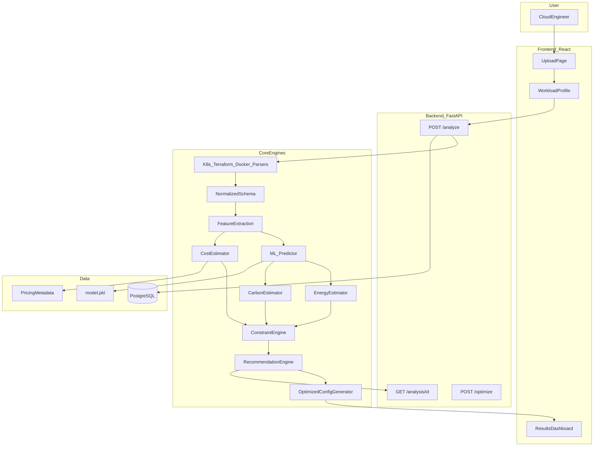

# EcoOps AI: 0 to 100% Implementation Plan

**Starting point:** Only [`EcoOps-AI project design.md`](/home/helios_neo16/EcoOps-AI/EcoOps-AI%20project%20design.md) exists — no code, git, or dependencies.

**Target:** Full working prototype per design doc success criteria (Section 40), demo-ready locally via Docker, with AWS as optional Phase 18.

**Timeline:** ~6 months (24 weeks), aligned with design doc Phases 1–17 + optional deploy.

**Team model:** Rehann leads ~95% implementation; Krishna assists on ML/dataset (~5%); others focus on docs/demo/report.

---

## Architecture Target



---

## Repository Structure (Phase 1)

Scaffold per design doc Section 34:

```
EcoOps-AI/
  backend/app/          # FastAPI
  frontend/src/         # React + Tailwind
  ml/                   # training scripts, notebooks
  datasets/             # gitignored; download instructions only
  infrastructure/       # sample K8s/Terraform/Docker demo files
    kubernetes/
    terraform/
    docker/
  tests/
  docs/
  scripts/
  docker-compose.yml
  README.md
  .gitignore
```

**Week 1 deliverables:**
- Init git (`main` + `develop` branches per Section 35)
- Backend skeleton: `main.py`, health check, CORS, logging, env config
- Frontend skeleton: Vite + React + Tailwind, landing page stub
- `docker-compose.yml`: backend + postgres (frontend dev can run locally first)
- CI stub: lint + pytest on push (GitHub Actions)

---

## Phase Map (0 → 100%)

| Phase | Weeks | % Complete | Focus |
|-------|-------|------------|-------|
| 1. Foundation | 1–2 | 10% | Repo, API shell, DB schema |
| 2. K8s Parser MVP | 3–4 | 20% | Upload → parse → JSON (no ML) |
| 3. Schema + Features | 5 | 25% | Normalized schema, feature extraction |
| 4. ML Pipeline | 6–9 | 45% | Dataset prep, train, predict API |
| 5. Estimation Engines | 10–11 | 55% | Energy, carbon, cost |
| 6. Constraint + Recommend | 12–14 | 70% | Optimization logic, explainability |
| 7. Config Generation | 15 | 75% | Optimized YAML + diff |
| 8. Frontend Dashboard | 16–19 | 90% | Full UI workflow |
| 9. Extended Parsers | 20–21 | 95% | Terraform + Docker Compose |
| 10. Integration + Testing | 22–23 | 98% | E2E, demo scenarios, docs |
| 11. Dockerization | 23 | 99% | One-command local demo |
| 12. AWS (optional) | 24+ | 100% | Stretch: EC2/ECS + RDS |

---

## Phase 1: Foundation (Weeks 1–2) — 0% → 10%

**Goal:** Runnable monorepo with API health check and database ready.

### Backend ([`backend/app/`](/home/helios_neo16/EcoOps-AI/backend/app/))
- FastAPI app structure per Section 25: `api/routes/`, `core/config.py`, `schemas/`, `models/`
- PostgreSQL via SQLAlchemy + Alembic migrations
- Core entities (Section 28): `Analysis`, `InfrastructureConfiguration`, `Prediction`, `Recommendation`, `OptimizationResult`
- Skip full auth for MVP (Section 33 lists auth as v2); use analysis UUID as access key

### Frontend ([`frontend/src/`](/home/helios_neo16/EcoOps-AI/frontend/src/))
- Pages stubbed: Landing, Upload, Workload Profile, Results
- API client service layer

### Security baseline (Section 29)
- Max upload size, allowed extensions (`.yaml`, `.yml`, `.tf`)
- No shell execution on uploads; parse as text only

**Exit criteria:** `docker-compose up` starts API + DB; `GET /health` returns 200; empty upload endpoint accepts file metadata.

---

## Phase 2: Kubernetes Parser (Weeks 3–4) — 10% → 20%

**First code task per Section 42 — before any ML.**

### Parser ([`backend/app/parsers/kubernetes_parser.py`](/home/helios_neo16/EcoOps-AI/backend/app/parsers/kubernetes_parser.py))
Extract from Deployment manifests:
- `deployment name`, `namespace`, `replicas`
- CPU/memory requests and limits (normalize units: cores, Gi → GB)
- HPA / autoscaling flags
- Container image (metadata only)

### API endpoints
- `POST /api/v1/validate` — syntax + supported kind check
- `POST /api/v1/analyze` — upload K8s YAML + store analysis record
- `GET /api/v1/analysis/{id}/configuration` — normalized JSON

### Expected output (Section 42)
```json
{
  "source_type": "kubernetes",
  "application": "backend",
  "replicas": 5,
  "cpu_request": 2,
  "cpu_limit": 4,
  "memory_request_gb": 4,
  "memory_limit_gb": 8,
  "autoscaling_enabled": false
}
```

### Tests
- Unit tests with 3 sample manifests in [`infrastructure/kubernetes/`](/home/helios_neo16/EcoOps-AI/infrastructure/kubernetes/)
- Edge cases: missing resources block, multi-container pod (aggregate or primary container policy — document choice)

**Exit criteria:** Upload real K8s YAML via API/curl → valid normalized JSON stored and retrievable.

---

## Phase 3: Normalized Schema + Workload Profile (Week 5) — 20% → 25%

### Unified schema ([`backend/app/schemas/infrastructure_schema.py`](/home/helios_neo16/EcoOps-AI/backend/app/schemas/infrastructure_schema.py))
Merge infrastructure + workload per Section 8:
- `application_type`, `expected_users`, `traffic_level`, `max_latency_ms`, `availability_target`
- `cpu`, `memory_gb`, `replicas`, `storage_gb`, `autoscaling_enabled`, `source_type`

### Workload profile input
- Extend `POST /api/v1/analyze` to accept workload JSON (Sections 4–5)
- Feature extraction module ([`backend/app/services/feature_service.py`](/home/helios_neo16/EcoOps-AI/backend/app/services/feature_service.py)) produces ML-ready feature vector

**Exit criteria:** Single API call returns merged infra + workload features as structured JSON.

---

## Phase 4: ML Pipeline (Weeks 6–9) — 25% → 45%

**Krishna assists:** dataset download, cleaning, feature engineering review.

### Dataset ([`ml/`](/home/helios_neo16/EcoOps-AI/ml/))
- Google Cluster Workload Traces 2019 sample (Section 13) — document download steps; keep data gitignored
- Cleaning + feature engineering script
- Document synthetic/derived features where dataset lacks them (Section 14)

### Model training
- Start with **Random Forest Regressor** (Section 12)
- Targets: `predicted_cpu_utilization`, `predicted_memory_utilization`
- Train/test split, metrics (MAE, RMSE, R²), save `model.pkl`
- Optional: compare XGBoost in v2 only if time permits

### Inference ([`backend/app/ml/predictor.py`](/home/helios_neo16/EcoOps-AI/backend/app/ml/predictor.py))
- Load model at startup via `model_loader.py`
- Wire into analysis pipeline after feature extraction
- Store predictions in DB

**Exit criteria:** Analysis endpoint returns utilization predictions driven by real model inference (not hard-coded).

---

## Phase 5: Sustainability Estimation (Weeks 10–11) — 45% → 55%

Keep **prediction vs estimation** clearly separated (Sections 15–17).

### Services
| Service | Input | Output |
|---------|-------|--------|
| [`energy_service.py`](/home/helios_neo16/EcoOps-AI/backend/app/services/energy_service.py) | utilization + infra | estimated kWh |
| [`carbon_service.py`](/home/helios_neo16/EcoOps-AI/backend/app/services/carbon_service.py) | energy × regional carbon intensity | estimated CO₂ |
| [`cost_service.py`](/home/helios_neo16/EcoOps-AI/backend/app/services/cost_service.py) | provider pricing table | estimated monthly cost |

### Config data
- [`backend/app/data/pricing/`](/home/helios_neo16/EcoOps-AI/backend/app/data/pricing/) — AWS instance metadata + pricing (Section 9: no hard-coded prices scattered in code)
- [`backend/app/data/carbon_intensity/`](/home/helios_neo16/EcoOps-AI/backend/app/data/carbon_intensity/) — region → gCO₂/kWh

### Sustainability score (Section 23)
- Weighted composite; weights in config file; label as methodology-based estimate

**Exit criteria:** `GET /api/v1/analysis/{id}` returns cost, energy, carbon, sustainability score with `estimated`/`predicted` labels.

---

## Phase 6: Constraint Engine + Recommendations (Weeks 12–14) — 55% → 70%

**Core differentiator per Section 18.**

### Constraint engine ([`backend/app/services/constraint_service.py`](/home/helios_neo16/EcoOps-AI/backend/app/services/constraint_service.py))
- Validate against `max_latency_ms`, `availability_target`, expected users/traffic
- Reject candidates that violate constraints (latency proxy from utilization + replicas heuristic — document methodology)

### Recommendation engine ([`backend/app/services/recommendation_service.py`](/home/helios_neo16/EcoOps-AI/backend/app/services/recommendation_service.py))
- Generate candidate configs (reduce CPU/memory/replicas, enable HPA, adjust limits)
- Evaluate each: predict → estimate → constraint check → rank
- Each recommendation includes (Section 19): current, suggested, reason, expected impact, constraint result

### Explainability (Section 20)
- Rule-based explanations + feature importance from Random Forest
- SHAP only if time remains (v2)

### API
- `POST /api/v1/analysis/{id}/optimize`
- `GET /api/v1/analysis/{id}/recommendations`

**Exit criteria:** Overprovisioned sample manifest yields multiple ranked recommendations; well-provisioned sample yields few/none (Section 30 — no fake results).

---

## Phase 7: Optimized Configuration Generator (Week 15) — 70% → 75%

### Generator ([`backend/app/services/optimization_service.py`](/home/helios_neo16/EcoOps-AI/backend/app/services/optimization_service.py))
- Produce modified K8s YAML from accepted recommendations
- **Never overwrite original** — store both versions (Section 21)
- Text diff for preview
- `GET /api/v1/analysis/{id}/optimized-config` + download

**Exit criteria:** User can download optimized YAML; diff shows replicas/resources changes.

---

## Phase 8: Frontend Dashboard (Weeks 16–19) — 75% → 90%

Build pages per Section 26:

1. **Landing** — project value prop
2. **Upload** — drag-drop K8s YAML
3. **Workload Profile** — form for app type, users, traffic, latency, availability
4. **Results Dashboard** (Section 22):
   - Overview: sustainability score, cost, energy, carbon, utilization charts (Recharts)
   - Problems detected
   - Recommendations table with impact columns
   - Current vs optimized comparison
   - Config diff viewer + download button

**Exit criteria:** Full workflow completable in browser without curl; professional but not over-engineered UI.

---

## Phase 9: Extended Parsers (Weeks 20–21) — 90% → 95%

Priority order from Section 11: K8s done → Terraform → Docker Compose.

### Terraform ([`backend/app/parsers/terraform_parser.py`](/home/helios_neo16/EcoOps-AI/backend/app/parsers/terraform_parser.py))
- Python HCL parser
- AWS EC2 instance type → metadata lookup service
- Map to same normalized schema

### Docker Compose ([`backend/app/parsers/docker_compose_parser.py`](/home/helios_neo16/EcoOps-AI/backend/app/parsers/docker_compose_parser.py))
- Simpler extraction: services, replicas, CPU, memory limits

**Exit criteria:** All three formats produce identical schema shape; downstream ML/recommendation code unchanged.

---

## Phase 10: Integration, Testing, Demo Prep (Weeks 22–23) — 95% → 98%

### Demo scenarios (Section 30) — [`infrastructure/`](/home/helios_neo16/EcoOps-AI/infrastructure/)
| Scenario | Config | Expected |
|----------|--------|----------|
| Good | Right-sized K8s | Few/no recommendations |
| Moderate | Slightly overprovisioned | Some recommendations |
| Bad | 8 CPU, 16GB, 8 replicas, no autoscaling | Multiple recommendations |

### Testing pyramid
- **Unit:** parsers, feature extraction, estimators, constraint checks
- **Integration:** full analyze → optimize pipeline
- **E2E:** frontend upload → dashboard (Playwright optional)

### Documentation
- [`README.md`](/home/helios_neo16/EcoOps-AI/README.md): setup, env vars, demo steps
- [`docs/architecture.md`](/home/helios_neo16/EcoOps-AI/docs/architecture.md): module diagram, API reference
- Report appendix: methodology, limitations (Section 39)

**Exit criteria:** All 15 success criteria from Section 40 verified locally.

---

## Phase 11: Dockerization (Week 23) — 98% → 99%

- Production-style `docker-compose.yml`: backend + frontend + postgres
- Backend serves API; frontend nginx or built static assets
- Model file mounted or baked into backend image
- One-command demo: `docker compose up --build`

**Exit criteria:** Fresh machine can run full demo with only Docker installed.

---

## Phase 12: AWS Deployment — Optional Stretch (Week 24+)

Per design doc Section 24 — minimal services only:
- EC2 or ECS for backend + frontend
- RDS PostgreSQL
- S3 optional for uploaded IaC storage
- No unnecessary AWS services

**Exit criteria:** Public URL serves demo; document deploy runbook in [`docs/deployment-aws.md`](/home/helios_neo16/EcoOps-AI/docs/deployment-aws.md).

---

## What NOT to Build Before MVP (Section 33)

Defer until core K8s pipeline is stable:
- User authentication
- SHAP / XGBoost comparison
- Multi-cloud support
- Historical analysis / scenario simulation
- Monitoring integration

---

## Risk Mitigation

| Risk | Mitigation |
|------|------------|
| Google dataset missing features | Document derived features; use synthetic workload mapping (Section 14) |
| Constraint/latency hard to predict | Use documented heuristics; label as estimated; never claim guaranteed performance |
| Scope creep | Strict phase gates; no Terraform until K8s MVP works |
| Team bandwidth | Modular services; Rehann owns integration; Krishna owns ML scripts only |
| Fake demo results | Section 30: all demo outputs from real pipeline |

---

## Suggested First Sprint (This Week)

1. Init git repo + folder structure
2. FastAPI hello + health + file upload stub
3. K8s parser for single Deployment YAML
4. `POST /api/v1/analyze` returning normalized JSON
5. 3 parser unit tests + sample YAML in `infrastructure/kubernetes/`

This matches Section 42 and unblocks everything downstream.
